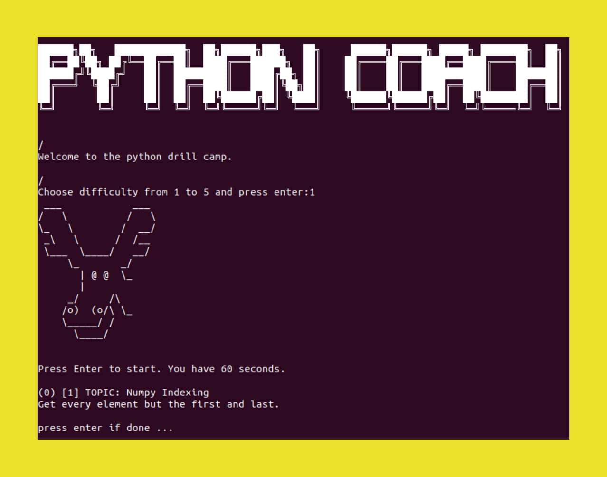

<h1 align="center">Python Coach</h1>


<table  align='center'>
<tr>
<td>
Python training for machine learning: This is a little repo that helps me to get fluent in python. It's basically a robot that gives you one questions after another which have to be solved in a specific time. You can choose your difficulty, see your progress (score) over time, and create new questions in the python_questions.txt and python_questions_numpy.txt. So far, there is no mechanism to check if your answers are correct. The logic here is, that if you know how to solve the question, it is not important whether the answer is "bug free", as long as you are sure how to code it. If you do not know the answer, just google it and make a note somewhere that you don't forget it. Then, if the question pops up a second time, you can solve it quickly and increase your score. There are not a lot of questions yet, but coding consists mostly of the same repeating things, so I will build up the question stack over time and expect to have covert a lot in about 1000 questions. Happy coding.</td>
</tr>
</table>

<p align="center"> 
  
</p>


---


<!-- TABLE OF CONTENTS -->
<h2 id="table-of-contents"> :book: Table of Contents</h2>
<p id="getting_started"></p>

<details open="open">
  <summary>Table of Contents</summary>
  <ol>
    <li><a href="#quick_start"> ➤ Quick start</a></li>
    <li><a href="#usage"> ➤ Usage</a></li>
    <li><a href="#config"> ➤ Config</a></li>
    <li><a href="#docker"> ➤ Docker</a></li>
    <li><a href="#troubleshooting"> ➤ Troubleshooting</a></li>
    <li><a href="#tests"> ➤ Tests</a></li>
    <li><a href="#roadmap"> ➤ Roadmap</a></li>
    <li><a href="#acknowledgements"> ➤ Acknowledgements</a></li>
  </ol>
</details> 


## Quick start
<p id="quick_start"></p>

Linux installation:

```sh
pip install -r requirements.txt # install requirements
```

Run:

```sh
python coach.py 
```


## Usage
<p id="usage"></p>

- Run the "coach.py" in a terminal, choose the difficulty and solve the questions in whatever IDE you like. It's about speed and not correctness
- To change the set of questions used, you can set the PATH_QUESTIONS in "coach.py". Default is "python_questions_numpy.txt"
- Available set of questions are currently "python_questions_numpy.txt" and "python_questions.txt"
- You can set the available time (minutes) with the variable DURATION in "coach.py"
- Your score is calculated by = sum_over_all_questions(difficulty(question))/time_taken
- There are 5 difficulties of questions

## Config
<p id="config"></p>


## Docker
<p id="docker"></p>


## Troubleshooting
<p id="troubleshooting"></p>


## Tests
<p id="tests"></p>


## Roadmap
<p id="roadmap"></p>


## Acknowledgements
<p id="acknowledgements"></p>


Thanks to unsplash.com/ for the images in the image folder.